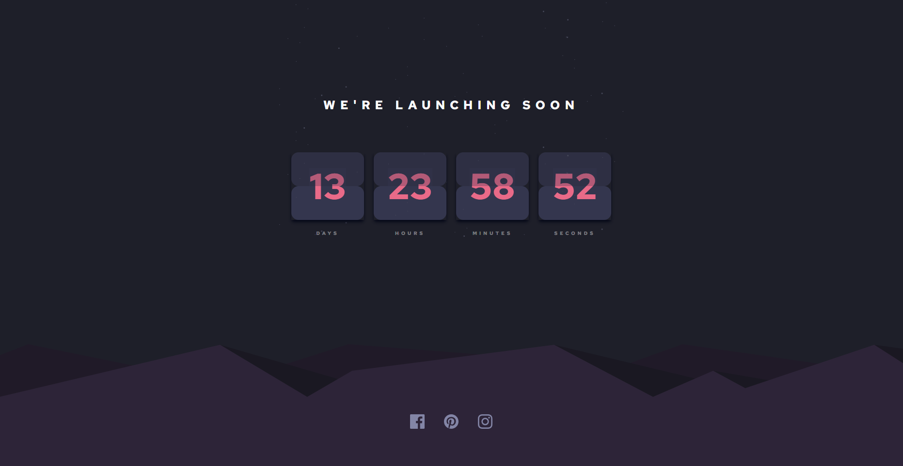

# Frontend Mentor - Launch countdown timer solution

This is a solution to the [Launch countdown timer challenge on Frontend Mentor](https://www.frontendmentor.io/challenges/launch-countdown-timer-N0XkGfyz-). Frontend Mentor challenges help you improve your coding skills by building realistic projects.

## Table of contents

- [Overview](#overview)
  - [The challenge](#the-challenge)
  - [Screenshot](#screenshot)
  - [Links](#links)
- [My process](#my-process)
  - [Built with](#built-with)
  - [What I learned](#what-i-learned)
  - [Continued development](#continued-development)
- [Author](#author)
- [Acknowledgments](#acknowledgments)

## Overview

### The challenge

Users should be able to:

- See hover states for all interactive elements on the page
- See a live countdown timer that ticks down every second (start the count at 14 days)

### Screenshot

### Links

- Solution URL: [Add solution URL here](https://github.com/RaidEyes/countdown-timer)
- Live Site URL: [Add live site URL here](https://raideyes.github.io/countdown-timer/)

## My process

### Built with

- Semantic HTML5 markup
- CSS custom properties
- Flexbox
- Mobile-first workflow
- [React](https://reactjs.org/) - JS library

### What I learned

I learn and apply Tailwind CSS to this project as well as consolidate my React.js knowledge. It was simple yet challenging when it comes to things I haven't touched before.

Give it a try.

### Continued development

I will surely use 100% of React and Tailwind for any upcoming projects to solidify my learning everyday.

## Author

- Frontend Mentor - [@yourusername](https://www.frontendmentor.io/profile/RaidEyes)

## Acknowledgments

Happy coding!!
